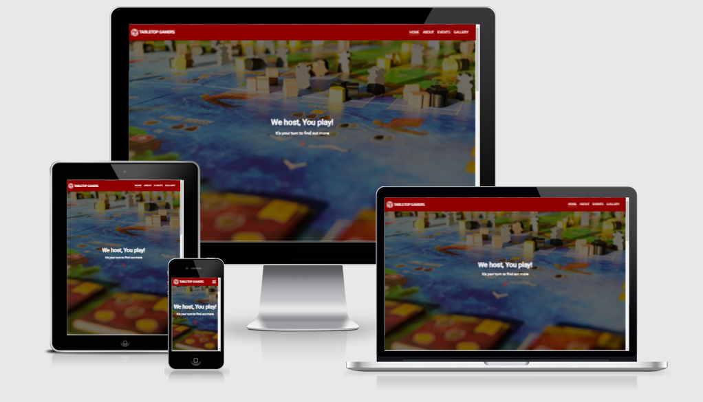
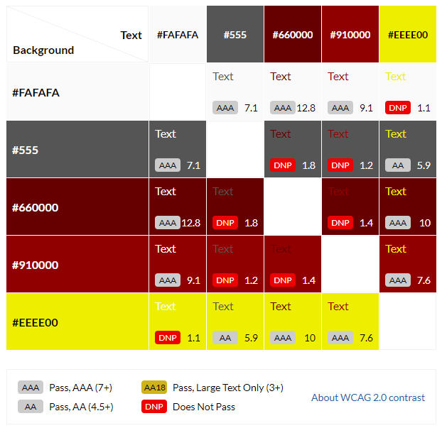
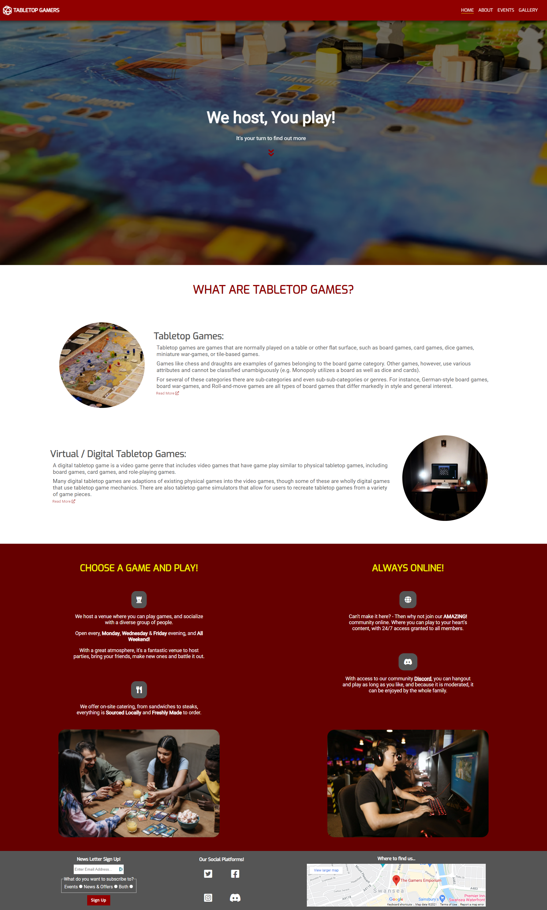
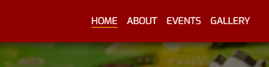
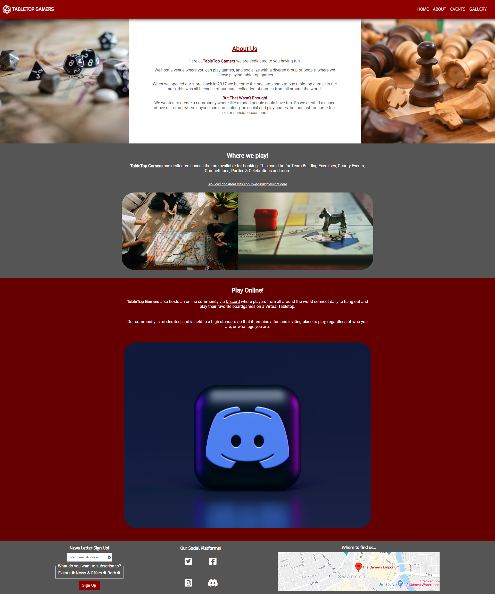
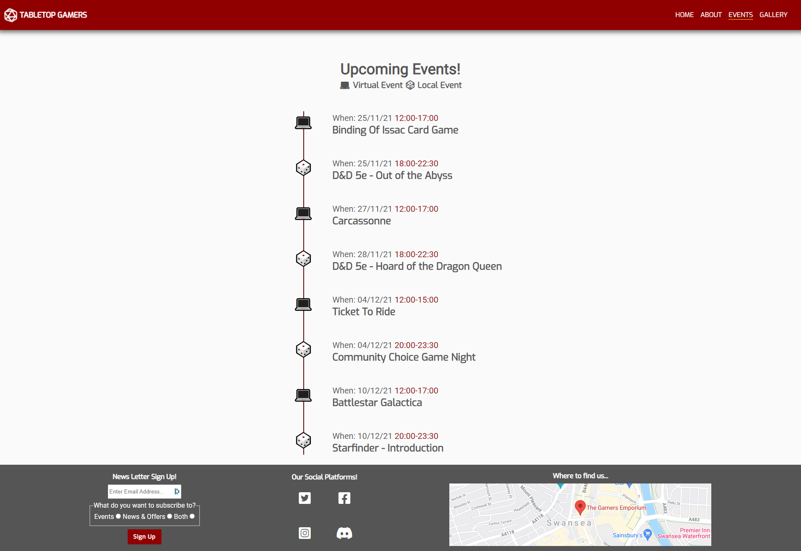

# 🎲 **TABLETOP GAMERS** 🃏



## **Project Overview**

The aim behind this project is to demonstrate my skills in the following areas:

* Designing a frontend web application, based around the principles of user experience, design, accessibility. All while being responsive so that the design is represented well on any device used to access the site.

* Developing and implementing a static frontend web application using HTML & CSS.

* Maximizing future maintainability through documentation, code structure and organisation.

* Usage of version control software to maintain, upload and share code with other developers.

* Testing and deploying a frontend web application to a cloud platform.

---

## **Site Overview**

The focus will be on creating a website for a fictional venue to use as a platform to advertise their services, create a single point of reference for upcoming events, display images/photos from previous events, and allow users to sign up to a newsletter.

The target audience is existing tabletop gamers, and newcomers showing an interest in Tabletop Games.

Tabletop games are games that are normally played on a table or other flat surface, such as board games, card games, dice games, miniature wargames, or tile-based games. [1]

Such games can also usually be played via a Virtual Tabletop (VTT) such as Tabletop Simulator, Fantasy Grounds or Roll20.

The site will contain references to both forms of tabletop gaming.

---

## **Table of contents**:
* [**Project Overview**](#project-overview)
* [**Site Overview**](#site-overview)
* [**User Experience (UX)**](#user-experience-ux)
  * [**User Stories**](#user-stories)
  * [**Design**](#design)
  * [**Wireframes**](#wireframes)
* [**Features**](#features)
* [**Technologies Used**](#technologies-used)
* [**Frameworks, Libraries and Programs Used**](#frameworks-libraries-and-programs-used)
* [**Planning Stage**](#planning-stage)
  * [**Target Audience**](#target-audience)
  * [**Site Aims**](#site-aims)
  * [**How I will Achieve This**](#how-i-will-achieve-this)
* [**Deployment**](#deployment)
  * [**Github Pages**](#github-pages)
  * [**Forking the GitHub Repository**](#forking-the-github-repository)
  * [**Making a local clone**](#making-a-local-clone)
  * [**Link to deployed website**](#link-to-deployed-website)
* [**Testing**](#testing)
* [**Credits**](#credits)
  * [**Citations**](#citations)
  * [**Media**](#media)
  * [**Acknowledgements**](#acknowledgements)

---

## **User Experience (UX)**

### **User Stories**:
* ### First Time Visitor Goals
  * As a first time visitor, I want to easily understand the main purpose of the site.
  * As a first time visitor, I want to be able to navigate the site to find content easily.
  * As a first time visitor, I want to understand what tabletop gaming is.
  * As a first time visitor, I want to locate the social media links.

* ### Returning Visitor Goals
  * As a returning visitor, I want to find information on upcoming events.
  * As a returning visitor, I want to be able to reach out and connect with an existing community, and find the best way to get in contact with any questions I may have.

* ### Frequent Visitor Goals
  * As a frequent visitor, I want to see if there are any new photos added to the gallery.
  * As a frequent visitor, I want to sign up to the Newsletter so that I am emailed with any updates on news, events and offers.

### **Design**:

**Colours**:

*  `#fafafa`
*  `#555`
*  `#660000`
*  `#910000`
*  `#eeee00`

These are the main colours used throughout the project, and contract was checked between the different colours using a [Contrast Grid](https://contrast-grid.eightshapes.com/?version=1.1.0&background-colors=&foreground-colors=%23fafafa%0D%0A%23555%0D%0A%23660000%0D%0A%23910000%0D%0A%23eeee00&es-color-form__tile-size=compact&es-color-form__show-contrast=aaa&es-color-form__show-contrast=aa&es-color-form__show-contrast=aa18&es-color-form__show-contrast=dnp).



**Typography**:
* Two fonts are used throughout the project, Roboto is used for all main text. With Exo being used for headings. Sans Serif as the fallback font in case for any reason the font is not being imported into the site correctly.


**Imagery**:
* Imagery is especially important in this project, the large hero background image is designed to be striking and catch the user's attention.

### **Wireframes**
To organize and streamline the development process, I created wireframes for this project, to help me during the development process and to prevent scope creep.

Below are links to each wireframe page of the project, created to cover both Mobile and Desktop versions.

* **Mobile Wireframes**:
  * [Homepage](https://github.com/Niki-Tester/tabletop-gamers/blob/main/doc/wireframes/mobile/homepage_mobile.png)
  * [About](https://github.com/Niki-Tester/tabletop-gamers/blob/main/doc/wireframes/mobile/about_mobile.png)
  * [Events](https://github.com/Niki-Tester/tabletop-gamers/blob/main/doc/wireframes/mobile/events_mobile.png)
  * [Gallery](https://github.com/Niki-Tester/tabletop-gamers/blob/main/doc/wireframes/mobile/gallery_mobile.png)

* **Desktop Wireframes**:
  * [Homepage](https://github.com/Niki-Tester/tabletop-gamers/blob/main/doc/wireframes/desktop/homepage_desktop.png)
  * [About](https://github.com/Niki-Tester/tabletop-gamers/blob/main/doc/wireframes/desktop/about_desktop.png)
  * [Events](https://github.com/Niki-Tester/tabletop-gamers/blob/main/doc/wireframes/desktop/events_desktop.png)
  * [Gallery](https://github.com/Niki-Tester/tabletop-gamers/blob/main/doc/wireframes/desktop/gallery_desktop.png)

---

## **Features**:
* Responsive on all device sizes
* Interactive elements

## **Technologies Used**:
* [HTML5](https://en.wikipedia.org/wiki/HTML5)
* [CSS3](https://en.wikipedia.org/wiki/Cascading_Style_Sheets)
* [JavaScript](https://en.wikipedia.org/wiki/JavaScript)

A small amount of Javascript is used for opening and closing the navigation menu on smaller screens. This was implemented instead of having to bring in the boot-strap framework just for this feature.

## **Frameworks, Libraries and Programs Used**:

1. [Google Fonts](https://fonts.google.com/):
   * Google fonts was used to import the 'Roboto' & 'Exo' fonts into the style.css file which is used on all pages throughout the project.

1. [Font Awesome](https://fontawesome.com/):
   * Font Awesome was used on all pages throughout the website to add icons for aesthetic and UX purposes.

1. [Git](https://git-scm.com/):
   * Git was used for version control by utilizing the Gitpod terminal to commit to Git and Push to GitHub.

1. [GitHub](https://github.com/):
   * GitHub is used to store the projects code after being pushed from Git.

1. [Balsamiq](https://balsamiq.com/):
   * Balsamiq was used to create the wireframes during the design process.

## **Planning Stage**

### **Target Audience**:
* People who are already playing tabletop games, but are looking for a group to play and socialize with.
* People who are new to tabletop games, looking to join a group of existing players.
* People who have never heard of tabletop games previously.
* People who have heard of tabletop games, but are looking for more information on the subject.

### **Site Aims**:
* Provide the user with some basic information on what tabletop games are, and include external links to free resources for further reading.
* Provide the user an option to sign up to a newsletter.
* Provide the user with a timeline of future events.
* Provide the user with a photo/image gallery for past events.
* Provide the user with a summary of services offered, and a location on where to join a group.

### **How I Achieved This**:
* Starting with the home page, this will provide a summary of what tabletop gaming is, and include at a glance information on events, about who the client is, and what services they offer.



* Each subject will then have a dedicated page (About / Events / Gallery), each containing further information.



* The about page will contain information about the client, and the services they offer.



* The events page will contain a timeline of dates / times and locations for upcoming events.



* The gallery page will contain an assortment of images/photos, captured from within the clients premises and from recently held events.


* Each page will have a header containing the company name and logo, along with the navigation elements, and a footer containing a small form for signing up to the newsletter, along with social media links, and a Google Map displaying the venues location.


---

## **Deployment**

### **Github Pages**

The project was deployed to GitHub Pages using the following steps:

1. Log in to GitHub and locate the GitHub Repository
1. At the top of the Repository, locate the "Settings" Button on the menu.
1. Scroll down the Settings page and locate "GitHub Pages".
1. Under "Source", click the dropdown called "None" and select "Master Branch".
1. Scroll back down to locate the now published site link in the "GitHub Pages" section.

### **Forking the GitHub Repository**
By forking the GitHub Repository you make a copy of the original repository on your GitHub account to view and/or make changes without affecting the original repository.

You can do this by completing the following steps:

1. Log in to GitHub and locate the GitHub Repository
1. At the top of the Repository (not top of page) just above the "Settings" Button on the menu, locate the "Fork" Button.
1. You should now have a copy of the original repository in your GitHub account.

### **Making a Local Clone**:
1. Log in to GitHub and locate the GitHub Repository
1. Under the repository name, click "Clone or download".
1. To clone the repository using HTTPS, under "Clone with HTTPS", copy the link.
1. Open Git Bash
1. Change the current working directory to the location where you want the cloned directory to be made.
1. Type git clone, and then paste the URL you copied in Step 3.

```
$ git clone https://github.com/Niki-Tester/tabletop-gamers.git
```

### *Link to deployed website*:
[GitHub Pages - Tabletop Gamers](https://niki-tester.github.io/tabletop-gamers/)

---

## **Testing**
Both during and after development issues/bugs were found as part of the testing process, where results did not meet expectations.
These issues/bugs have been documented separately, and can be found below.

This is also where any testing that has been completed will be documented, and resolutions to raised issues.

[Development & Post Development Testing Document](TESTING.md)

---

## **Credits**:

### **Citations**

[1] - Leading line from [Wikipedia - Tabletop Game](https://en.wikipedia.org/wiki/Tabletop_game)

Tabletop Games article - [Wikipedia - Tabletop Game](https://en.wikipedia.org/wiki/Tabletop_game)

Virtual / Digital Tabletop Games article - [Wikipedia - Digital Tabletop Game](https://en.wikipedia.org/wiki/Digital_tabletop_game)

### **Media**

Logo used in header owned by developer.

Hero Image used in index.html by [Christopher Paul High](https://unsplash.com/@christopherphigh?utm_source=unsplash&utm_medium=referral&utm_content=creditCopyText) from [Unsplash](https://unsplash.com/s/photos/tabletop-games?utm_source=unsplash&utm_medium=referral&utm_content=creditCopyText)

All images in gallery.html are from [Pexels](https://images.pexels.com) with a "Free to use" license.

### **Acknowledgements**
* Slack community for all the feedback, and help testing the project on various devices.

* My Mentor for continuous helpful feedback.

* Tutor support at Code Institute for their support.