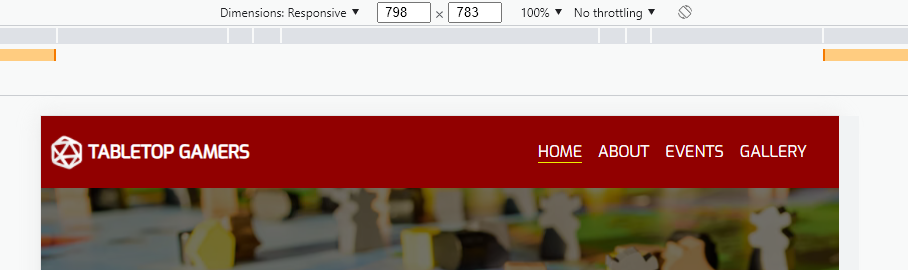

# DEVELOPMENT & POST DEVELOPMENT TESTING

## Testing User Stories from User Experience (UX)

* ### First Time Visitor Testing

  * As a first time visitor, I want to easily understand the main purpose of the site.
    * When the site is loaded, the user is presented with a site that has been designed to be fluid, and never entrap the user. At the top of each page there is a link which clearly describes what page they will end up on after clicking the link.
    *  At the bottom of each page is a footer which is consistent throughout the site, providing the user with quick and easy access to the news letter sign up form, along with social media links and a google map displaying the location of the store.

  * As a first time visitor, I want to be able to navigate the site to find content easily.
    * When the site is loaded, the user is greeted with a navigation bar at the top of the page, which contains links to access other pages on the site, which is consistent throughout the site, and is fixed to the top of the page, so that it is always visible. 
    * On mobile the navigation bar is hidden, and the user presented with a button to open a navigation menu, which when used animates a menu that is rendered above the page content and contains the same navigation bar. This is also consistent throughout the site, and is fixed to the top of the page, so that is is always visible.
    
  * As a first time visitor, I want to understand what tabletop gaming is.
    * When the site has loaded, the user is presented with a hero image, along with a title, below which is a call to action link, using a Font Awesome icon in an "\<a>" element. This has a CSS animation changing its colour from white to red which loops indefinitely, as a call to action.
    * The user has two options, clicking the call to action icon, or scrolling down, both of which will lead to a section on the home page providing the user information on what tabletop gaming is.

  * As a first time visitor, I want to locate the social media links.
    * Once the new visitor has read the information on the home page they will notice the footer at the bottom of the page that contains three sections. The middle section within the footer contains all the links the organizations has a social media account on. This footer is presented throughout the site, and is found at the bottom of each page that the site contains.

* ### Returning Visitor Goals
  * As a returning visitor, I want to find information on upcoming events.
    * Once the site has loaded, a returning visitor can easily find a link in the navigation bar / menu to the "Events" page, which contains a list of upcoming events, displaying both events available to attend in person at the stores location, and online via discord. These events are clearly marked which are in person and which are online. This is done using icons to represent each type, to which there is a key at the top of the page to clarify which icon corresponds to which type of event.

  * As a returning visitor, I want to be able to reach out and connect with an existing community, and find the best way to get in contact with any questions I may have.

    * At the bottom of each page the user will find a footer that contains links to all the social media links for the organisation where the user can reach out to contact someone from "Tabletop Gamers".
    * The user will also find a link to the discord server, where they are able to connect with the community online.
    * The user will find a map to for the location of the organizations premises should they wish to connect with the community in person.

* ### Frequent Visitor Goals
  * As a frequent visitor, I want see if there are any new photos added to the gallery.
    * Once the site has loaded, a frequent user can easily find a link in the navigation bar / menu to the sites "Gallery" page, which contains all the images from recent events and previous events, posted by the organisation.

  * As a frequent visitor, I want to sign up to the Newsletter so that I am emailed with any updates on news, events and offers.
    * Within the footer of the site, displayed on each page the site offers, is a "Newsletter Sign Up" form, where the user can enter their email address, and choose between receiving updates to just Events, News and Offers, or subscribe to both.


## Development Testing

Below is a list of issues found during the development process, detailing the issues found, the expected results, and any resolutions, along with the relevant commit if the issue was resolved.

---

**Issue Found:**

- HTML rendered without any styling. Only showing default browser style when viewing via GitHub Pages, styling loads correctly when viewed via GitPod.

**Expected Result:**

- Site to load with all implemented custom styling from style.css file to match that from local build in GitPod.

**Resolution:**

- Changed path from an absolute path to a relative path.

Previous Path:
 ```html
<link rel="stylesheet" href="/assets/css/style.css">
```

Updated Path:
```html
<link rel="stylesheet" href="assets/css/style.css">
```

**Commit:**
[8827bb1194a1c89e4e46f653d2b2ee64c1c9b2e1](https://github.com/Niki-Tester/tabletop-gamers/commit/8827bb1194a1c89e4e46f653d2b2ee64c1c9b2e1)

---

**Issue Found:**

- logo.png not being rendered within header when viewing via GitHub Pages. Contents of alt attribute is visible. Logo is being rendered as expected when being viewed via GitPod.

**Expected Result:**

- logo.png expected to load within header element.

**Resolution:**

- Changed path from an absolute path to a relative path. 

Previous Path:
```html 

```
Updated Path:
```html 

```

**Commit:**
[8827bb1194a1c89e4e46f653d2b2ee64c1c9b2e1](https://github.com/Niki-Tester/tabletop-gamers/commit/8827bb1194a1c89e4e46f653d2b2ee64c1c9b2e1)

---

**Issue Found:**

- Nav-Menu dropdown for small screens, does not always sit at bottom of header, leaving a gap between the top of the nav-menu, and the bottom of the header. This means the content behind the menu is visible in that gap.

**Expected Result:**

- Menu should drop no lower than the bottom of the header, so that there is no gap between the bottom of the header and the top of the nav-menu.

**Resolution:**

- After researching I have found that it is possible to get the dimensions of an element, (inc. any margin and padding) in pixels using [HTMLElement.offsetHeight](https://developer.mozilla.org/en-US/docs/Web/API/HTMLElement/offsetHeight) and [HTMLElement.offsetWidth](https://developer.mozilla.org/en-US/docs/Web/API/HTMLElement/offsetWidth), although I only need to use the Height property to fix this issue.

- I did this by getting the height of the header and setting the yOffset of the Nav-Menu to that value, this means that regardless of how big the header is, the Nav-Menu will always line up at the bottom of the header.

**Commit:**
[900ee98676934828523c73fd266818bcabe61ec1](https://github.com/Niki-Tester/tabletop-gamers/commit/900ee98676934828523c73fd266818bcabe61ec1)

---

**Issue Found:**

- When clicking anchor link on hero section, page scrolls to the linked section, but the top of the section is cut-off by the header.


    Left Image: Showing content of page under header.

    Right Image: Showing expected result.

**Expected Result:**

- Site should scroll so that the top of the linked section is brought to the top of the page, but the start of the section should still be below the header.

**Resolution:**

- I found that the issue was being caused because the header is fixed to the top of the page. After sometime, reading [CSS: Cascading Style Sheets](https://developer.mozilla.org/en-US/docs/Web/CSS) on MDN, I found that it is possible to set a [scroll-padding](https://developer.mozilla.org/en-US/docs/Web/CSS/scroll-padding) so that an offset can be set, to take into account the estimate hight of the header.

- I did this by giving the html element the [scroll-padding-top](https://developer.mozilla.org/en-US/docs/Web/CSS/scroll-padding) property, and used the browsers developer tools to view the height of the header, and used that value to set the padding in pixels.

- Applying just the pixel height of the header to [scroll-padding-top](https://developer.mozilla.org/en-US/docs/Web/CSS/scroll-padding) worked, but it still looked too close to the header, so I added an additional 10px to this property so that it looks more appealing.

- This will need to be adjusted for different screen sizes, especially if the headers height changes between screens.

**Commit:**
[941e575d8616a2a0c7d850fe0eeed44eced14ca6](https://github.com/Niki-Tester/tabletop-gamers/commit/941e575d8616a2a0c7d850fe0eeed44eced14ca6)

---

**Issue Found:**

- When toggling the menu button, visible on small screens, contained within the header, the menu renders above the menu & close button.

**Expected Result:**

- When the menu is displayed, it should be rendered below the header.

**Resolution:**

- Moved the navbar-container outside, and above the header, in index.html. This means that the Nav is rendered behind the header background.

**Commit:**
[869b740d7bf5b14fcb89891e77956abed026af9f](https://github.com/Niki-Tester/tabletop-gamers/commit/869b740d7bf5b14fcb89891e77956abed026af9f)

---

**Issue Found:**

- Menu is visible below the header, even when menu is closed.


**Expected Result:**

- Menu should only be visible when the menu is open.

**Resolution:**

- Changed display property on navbar-container to fixed.

**Commit:**
[21dda936402788d004f6e0451d39a7995189ff47](https://github.com/Niki-Tester/tabletop-gamers/commit/21dda936402788d004f6e0451d39a7995189ff47)

---

**Issue Found:**

- Menu is not extending the full width of the screen.

**Expected Result:**

- Menu should extend the full width of the screen, and not be just show on the right side.

**Resolution:**

- Changed display property on navbar-container to fixed.

**Commit:**
[21dda936402788d004f6e0451d39a7995189ff47](https://github.com/Niki-Tester/tabletop-gamers/commit/21dda936402788d004f6e0451d39a7995189ff47)

---

**Issue Found:**

- When window is resized from above 767px to below 767px part of the navigation menu is visible under the header. When clicking the menu button the navigation menu is shown in full, which is expected, but when collapsing the navigation menu again it returns to still being visible under the header.




**Expected Result:**

- The navigation menu should not be visible under the header when closed.

**Resolution:**

- While the display property of the navbar-container is set to "none", it is removed from the DOM meaning the style applied from menu.js is not applied, such that when the screen size is reduced, the navbar-containers yOffset would be set to 0, when it needed to be set to the height of the navbar-container element.

- I resolved this by creating an event listener for "resize" on the window, so that once the navbar-container element is displayed the correct yOffset is recalculated and applied.

**Commit:**
[4cb83fe173df2d2f5a8566b6fc47ee7d77885b5b](https://github.com/Niki-Tester/tabletop-gamers/commit/4cb83fe173df2d2f5a8566b6fc47ee7d77885b5b)

---

**Issue Found:**

- hero-section text renders on top of navbar-container, meaning the text is visible if the menu is open and the page is scrolled up.


**Expected Result:**

- When scrolling up and text / images on the page should be rendered behind the menu.

**Resolution:**

- Setting the Z-Index property to 1 on the navbar-container forces the menu to be rendered above anything else on the page

**Commit:**
[6987725c8a41cd67d9f7d2c8680b772483b68a25](https://github.com/Niki-Tester/tabletop-gamers/commit/6987725c8a41cd67d9f7d2c8680b772483b68a25)

---

# Further Testing
### **HTML**:
The W3C Markup Validator and W3C CSS Validator Services were used to validate every page of the project to ensure there were no syntax errors in the project.

[W3C Markup Validator]():

* [Home Page Result](https://validator.w3.org/nu/?doc=https%3A%2F%2Fniki-tester.github.io%2Ftabletop-gamers%2Findex.html)

* [About Page Result](https://validator.w3.org/nu/?doc=https%3A%2F%2Fniki-tester.github.io%2Ftabletop-gamers%2Fabout.html)

* [Events Page Result](https://validator.w3.org/nu/?doc=https%3A%2F%2Fniki-tester.github.io%2Ftabletop-gamers%2Fevents.html)

* [Gallery Page Result](https://validator.w3.org/nu/?doc=https%3A%2F%2Fniki-tester.github.io%2Ftabletop-gamers%2Fgallery.html)

* [Signup Page Result](https://validator.w3.org/nu/?doc=https%3A%2F%2Fniki-tester.github.io%2Ftabletop-gamers%2Fsignup.html)

The gallery page is the only page with any feedback from the validator. The validator issues a "Warning" about the Gallery section lacking a heading, and advises to consider using h2-h6 elements to add identifying headings to all sections. It is by design that this section does not contain a header, as I wanted this page to be focused purely on the images it contains.

### **CSS**:

The sites cascading style sheet was tested and validated using the W3C CSS Validator, which returned no errors or warnings.

[W3C CSS Validator](https://jigsaw.w3.org/css-validator/) - [Results](http://jigsaw.w3.org/css-validator/validator?uri=https%3A%2F%2Fniki-tester.github.io%2Ftabletop-gamers%2F&profile=css3svg&usermedium=all&warning=1&vextwarning=)


### **Browsers / Devices**:
The website was tested on Google Chrome, Microsoft Edge and Safari browsers (Safari was tested by the slack community), and remained fully responsive and within design specification, across all browsers tested.

The website was viewed on a variety of devices such as Desktop, Laptop, iPhone 8, iPhone 13 and a Galaxy S21+. The site remained responsive and was within design specification across all devices tested.

A large amount of testing was done to ensure that all pages were linking correctly.

### **Lighthouse**:

### **Accessability**:
Accessability was tested using the [Wave Web AIM](https://wave.webaim.org/) evaluation tool to check all of the sites pages which returned no errors.